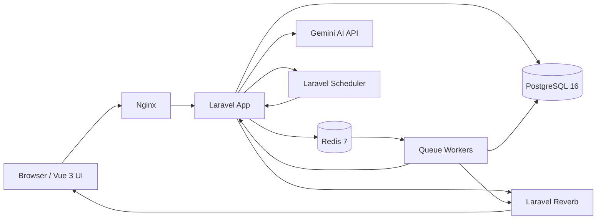

# FlowForge

FlowForge is a workflow automation platform for defining, executing, and monitoring automated workflows in real time. It combines a Laravel 11 backend, a Vue 3 frontend, Redis-backed queue processing, Laravel Reverb for live updates, and Gemini-powered workflow generation.

## What FlowForge Does

FlowForge is built around a few core workflows:

- create versioned workflow definitions as DAG-based automation flows
- trigger workflows manually, on schedule, or via webhook
- execute workflow steps through Redis queue workers with retries, cancellation, and global timeouts
- monitor runs live with step-by-step status, logs, traces, and health metrics
- generate starter workflow JSON from natural-language prompts with an AI assistant

## Tech Stack

- PHP 8.3
- Laravel 11
- Vue 3 + TypeScript
- PostgreSQL 16
- Redis 7
- Laravel Reverb
- Gemini AI
- Docker Compose

## Architecture



## Prerequisites

You only need:

- Docker Desktop
- Git

You do not need to install PHP, Composer, Node.js, PostgreSQL, or Redis locally.

## Quick Start

Run these five commands:

```bash
git clone https://github.com/faizfajar/FlowForge.git
cd FlowForge
cp .env.example .env
docker compose run --rm vite npm install
docker compose up -d --build && docker compose exec app php artisan key:generate --force && docker compose exec app php artisan migrate:fresh --seed
```

Then open:

- `http://localhost`

## Default Credentials

Seeder data creates users for two tenants: `acme-corp` and `beta-inc`.

Acme Corp:

- `admin@acme-corp.test` / `password` -> admin
- `editor@acme-corp.test` / `password` -> editor
- `viewer@acme-corp.test` / `password` -> viewer

Beta Inc:

- `admin@beta-inc.test` / `password` -> admin
- `editor@beta-inc.test` / `password` -> editor
- `viewer@beta-inc.test` / `password` -> viewer

## Main Features

- workflow CRUD with versioning and restore
- manual, scheduled, and webhook triggers
- multi-tenant isolation
- JWT-based API auth with admin, editor, and viewer roles
- queue-driven workflow execution with batched DAG waves
- realtime monitoring with Reverb private channels
- AI-assisted workflow generation with backend validation and guardrails

## Running Tests

Run the full suite:

```bash
docker compose exec app php artisan test
```

Run unit tests only:

```bash
docker compose exec app php artisan test --testsuite=Unit
```

Run feature tests only:

```bash
docker compose exec app php artisan test --testsuite=Feature
```

## Environment Variables Worth Knowing

These values matter for behavior and are easy to miss:

- `GEMINI_API_KEY`
  - API key used by the AI workflow generator.
  - Required for the "Generate with AI" flow.

- `JWT_SECRET`
  - Secret used for signing application JWT tokens.
  - If unset, the app can fall back to `APP_KEY`, but explicit configuration is better.

- `REVERB_HOST`
  - Internal hostname Laravel uses to broadcast to Reverb.
  - In Docker this is typically `reverb`.

- `WORKFLOW_RUN_TIMEOUT_SECONDS`
  - Global timeout for a workflow run.
  - Used to stop runs that exceed the allowed execution window.

## Useful Local Commands

Start or rebuild the stack:

```bash
docker compose up -d --build
```

Restart queue workers after queue code changes:

```bash
docker compose exec app php artisan queue:restart
```

Watch logs:

```bash
docker compose logs -f
```

Re-seed the database:

```bash
docker compose exec app php artisan migrate:fresh --seed
```

## Realtime Execution Model

The workflow engine currently runs in batched DAG waves:

- each dependency wave is dispatched through Laravel `Bus::batch()`
- step jobs run concurrently across multiple Redis workers
- delay steps release themselves back to the queue instead of blocking a worker
- scheduler-driven workflows are triggered every minute through Laravel's scheduler
- frontend monitoring is updated through Reverb private channels

## Trade-Offs

This project intentionally takes a few pragmatic shortcuts:

- Custom JWT implementation instead of `tymon/jwt-auth`
  - The auth flow stays explicit and local to the project, but the team owns more security surface directly.

- Delay handling uses queue release semantics instead of a dedicated delayed orchestration layer
  - This keeps the implementation simple and non-blocking, but it is still less sophisticated than a purpose-built workflow engine.

- Wave progression is coordinated through Laravel batches
  - This removes worker-blocking polling, but still relies on queue/batch state rather than a dedicated orchestration service.

- `SCRIPT` and `CONDITION` steps use Symfony ExpressionLanguage
  - Safer than arbitrary code execution, but intentionally limited compared to a full scripting runtime.

## Notes

- The monitoring UI is centered on the `/workflows` page as a single operational surface.
- Queue workers are configured to run multiple concurrent `queue:work` processes in Docker.
- PostgreSQL is exposed on local port `5435` for external inspection tools such as Navicat.
- The scheduler service runs `php artisan schedule:work`, so `schedule_cron` workflows can trigger automatically when the Docker stack is up.
