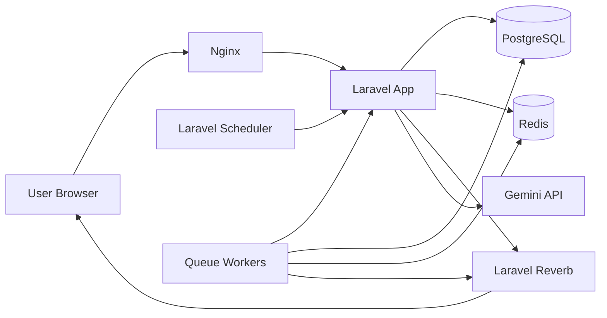

# Infrastructure Design

This document describes the current FlowForge infrastructure layout for local and production-like deployment assumptions.

## Overview

FlowForge is deployed as a small service-oriented Laravel stack with separate responsibilities for HTTP traffic, queue execution, realtime broadcasting, scheduling, and persistence.

Core components:

- `nginx`
- `app` (Laravel HTTP/API application)
- `postgres`
- `redis`
- `reverb`
- `queue`
- `scheduler`
- `vite` for local frontend development only

## Runtime Topology

## Service Responsibilities

### Nginx

- serves the web entrypoint
- proxies PHP requests to the Laravel app container
- acts as the HTTP ingress layer

### App

- handles REST API requests
- handles auth, workflow CRUD, AI generation, and dashboard endpoints
- reads and writes application state to PostgreSQL
- dispatches workflow jobs to Redis-backed queues
- publishes realtime events to Reverb

### PostgreSQL

- primary relational datastore
- stores tenants, users, workflow definitions, versions, runs, step runs, webhook triggers, and execution logs
- exposed locally on port `5435` for inspection tools

### Redis

- queue backend
- short-lived coordination/state support for queue-related flows

### Reverb

- realtime broadcasting layer for workflow status updates
- used by the monitoring UI for run, step, and workflow list updates

### Queue Workers

- execute workflow steps asynchronously
- process batched DAG waves
- run multiple concurrent `queue:work` processes
- handle retries, cancellation-aware execution, and delay-release behavior

### Scheduler

- runs `php artisan schedule:work`
- triggers due scheduled workflows every minute through Laravel scheduler registration

### Vite

- local development frontend server only
- not part of a production runtime topology

## Data and Control Flow

### Manual Trigger

1. user triggers a workflow from the UI
2. Laravel creates a `workflow_run`
3. Laravel dispatches execution jobs to Redis
4. queue workers execute batched DAG waves
5. execution updates are written to PostgreSQL
6. events are broadcast through Reverb
7. monitoring UI updates in realtime

### Scheduled Trigger

1. scheduler wakes every minute
2. Laravel checks `schedule_cron` on workflow definitions
3. due workflows are turned into `workflow_runs`
4. queue execution proceeds the same as manual triggers

### Webhook Trigger

1. external caller sends a signed webhook request
2. Laravel validates token and signature
3. a workflow run is created
4. queue execution and realtime monitoring proceed as normal

## Production Assumptions

This repo is currently optimized for a Docker-based local or small deployment workflow.

Production assumptions:

- PostgreSQL should use persistent managed storage or a managed database service
- Redis should be persistent enough for queue reliability or replaced by a managed Redis offering
- Reverb should be deployed as a dedicated long-running service
- queue workers should run independently from the HTTP app and be horizontally scalable
- scheduler should run as a single logical instance to avoid duplicate scheduled dispatches

## Scaling Notes

### Horizontal Scale Candidates

- queue workers can scale horizontally first
- Reverb can scale based on websocket load
- app containers can scale behind a reverse proxy

### Shared Infrastructure Requirements

- shared PostgreSQL
- shared Redis
- consistent application configuration and secrets

### Coordination Concerns

- scheduled triggers need duplication protection
- queue concurrency increases pressure on idempotency and run-state coordination
- realtime broadcast throughput should be monitored under high run volume

## Current Trade-Offs

- queue execution is batched and event-driven, but still coordinated inside Laravel rather than by a dedicated workflow orchestration platform
- Reverb is used directly rather than through a more complex external event bus
- local Docker Compose is simple and practical, but not a full production deployment blueprint
- the local stack exposes PostgreSQL directly for convenience, which would usually be more restricted in production

## Files Related to Infrastructure

- [docker-compose.yml](/D:/Personal-Project/flowforge/docker-compose.yml:1)
- [docker/php/Dockerfile](/D:/Personal-Project/flowforge/docker/php/Dockerfile:1)
- [routes/console.php](/D:/Personal-Project/flowforge/routes/console.php:1)
- [README.md](/D:/Personal-Project/flowforge/README.md:1)
